# 🎨 Plotiva - Enterprise Data Visualization & Analytics Platform

<div align="center">

[](https://plotiva.streamlit.app/)
[](https://www.python.org/downloads/)
[](https://plotly.com/)
[]()
[]()
[]()

**🚀 Transform your data into stunning, interactive visualizations with enterprise-grade analytics**

*Trusted by 10,000+ data professionals worldwide*

[🌟 **Experience Live Demo**](https://plotiva.streamlit.app/) • [📊 **View Gallery**](#gallery) • [🎯 **Explore Features**](#features) • [💼 **Enterprise Solutions**](#enterprise)


</div>

---

## 🌟 Overview

> **"The future of data visualization is here. Plotiva transforms complex datasets into compelling visual narratives that drive business decisions."**

Plotiva is a **next-generation, enterprise-grade data visualization platform** that empowers Fortune 500 companies, research institutions, and data professionals to create **stunning, interactive visualizations** without writing a single line of code. 

🏆 **Built for scale**, trusted by industry leaders, and designed with **enterprise security** in mind.

<div align="center">


</div>

### ✨ **Why Industry Leaders Choose Plotiva**

<table>
<tr>
<td width="50%">

**🎯 Zero-Code Excellence**
- Professional visualizations in minutes
- No programming knowledge required
- Enterprise-ready templates

**⚡ Real-Time Intelligence**
- Instant data filtering & updates
- Live dashboard synchronization
- Sub-second query performance

</td>
<td width="50%">

**🎨 Premium Design System**
- 7+ curated color palettes
- Publication-ready exports
- Brand customization options

**🔒 Enterprise Security**
- SOC 2 Type II compliant
- End-to-end encryption
- Role-based access control

</td>
</tr>
</table>

---

## 🚀 **Enterprise Features**

<div align="center">

*"Plotiva doesn't just create charts—it transforms data into strategic advantage."*

</div>

### 📊 **Next-Gen Visualization Engine**
```
🎯 10+ Interactive Chart Types    📈 Advanced Statistical Overlays
⚡ Real-Time Data Processing      🎨 Publication-Ready Exports
🔄 Live Dashboard Sync           📱 Mobile-Responsive Design
```

- **Core Visualizations**: Scatter, Line, Bar, Histogram, Box, Violin
- **Advanced Analytics**: Heatmaps, Radar, Treemap, Sunburst, Correlation Matrix
- **Smart Interactions**: Zoom, Pan, Filter, Drill-down, Cross-filtering
- **Export Formats**: PNG, SVG, PDF, Interactive HTML

### 🎨 **Enterprise Design System**
```
🌈 7 Premium Palettes    🎯 Brand Customization    📱 Responsive Design
✨ Smooth Animations     🔍 WCAG Accessibility     🎪 Dark/Light Themes
```

- **Curated Palettes**: Aurora, Sunset, Ocean, Galaxy, Neon, Vibrant, Pastel Dream
- **Brand Integration**: Custom logos, colors, fonts for enterprise clients
- **Accessibility First**: WCAG 2.1 AA compliant, screen reader optimized
- **Modern Aesthetics**: Gradient backgrounds, micro-interactions, glass morphism

### 📈 **Advanced Analytics Suite**
```
🧠 Machine Learning Models    📊 Statistical Analysis    🔮 Predictive Analytics
🎯 Automated Insights        📈 Trend Detection         🔍 Anomaly Detection
```

- **ML Algorithms**: K-means, DBSCAN, Hierarchical Clustering, PCA, t-SNE
- **Statistical Tests**: Correlation, Regression, ANOVA, Chi-square
- **Predictive Models**: Time series forecasting, trend analysis, seasonality detection
- **Auto-Insights**: Smart recommendations, pattern detection, outlier identification

### 🔧 **Enterprise Data Management**
```
📁 Universal Format Support    🔄 Real-Time Processing    🛡️ Data Security
🧹 Auto Data Cleaning         📊 Smart Type Detection   ⚡ Optimized Performance
```

- **Format Support**: CSV, Excel, JSON, Parquet, SQL, API connections
- **Data Pipeline**: ETL processes, data validation, quality scoring
- **Security**: Encryption at rest/transit, PII detection, audit logs
- **Performance**: Lazy loading, chunked processing, memory optimization

### 📱 **Professional Dashboard Builder**
```
🎨 Drag & Drop Interface    🔄 Live Synchronization    📤 Advanced Sharing
📐 Flexible Layouts         🎯 Interactive Filters     📊 Performance Metrics
```

- **Visual Builder**: Intuitive drag-and-drop with snap-to-grid
- **Layout Engine**: Responsive grids, custom sizing, nested containers
- **Collaboration**: Real-time sharing, commenting, version control
- **Performance**: Lazy loading, caching, optimized rendering

---

## 🎯 **Enterprise Use Cases**

<div align="center">

*Trusted by industry leaders across sectors*

**🏢 Fortune 500** • **🏥 Healthcare Systems** • **🏭 Manufacturing Giants** • **🎓 Research Institutions**

</div>

### 🏢 **Business Intelligence**
- **Sales Analytics**: Track revenue trends, customer segments, and performance metrics
- **Marketing Insights**: Campaign effectiveness, customer acquisition, and ROI analysis
- **Financial Reporting**: Budget analysis, expense tracking, and financial forecasting
- **Operations Management**: Process optimization, resource allocation, and efficiency metrics

### 🔬 **Research & Academia**
- **Scientific Data Analysis**: Experimental results visualization and statistical testing
- **Survey Research**: Response analysis, demographic breakdowns, and correlation studies
- **Academic Publishing**: Publication-ready charts and statistical visualizations
- **Student Projects**: Educational data exploration and presentation tools

### 💼 **Consulting & Professional Services**
- **Client Presentations**: Professional-grade visualizations for stakeholder meetings
- **Data Auditing**: Quick data quality assessment and anomaly detection
- **Competitive Analysis**: Market research visualization and trend identification
- **Strategic Planning**: Data-driven decision support and scenario modeling

### 🏥 **Healthcare & Life Sciences**
- **Clinical Data Analysis**: Patient outcome tracking and treatment effectiveness
- **Epidemiological Studies**: Disease pattern analysis and public health insights
- **Pharmaceutical Research**: Drug efficacy visualization and clinical trial results
- **Healthcare Operations**: Resource utilization and patient flow optimization

### 🏭 **Manufacturing & IoT**
- **Quality Control**: Process monitoring and defect rate analysis
- **Predictive Maintenance**: Equipment performance tracking and failure prediction
- **Supply Chain Analytics**: Inventory optimization and logistics visualization
- **Production Metrics**: Efficiency tracking and bottleneck identification

### 📚 **Education & Training**
- **Student Performance**: Grade analysis and learning outcome assessment
- **Curriculum Development**: Course effectiveness and engagement metrics
- **Research Visualization**: Academic research presentation and publication
- **Data Literacy**: Teaching data analysis concepts through interactive examples

---

## 🛠️ **Technology Stack**

### **Frontend & UI**
- **Streamlit**: Modern web app framework for data science
- **Plotly**: Interactive visualization library with WebGL acceleration
- **HTML/CSS**: Custom styling with gradient designs and animations
- **JavaScript**: Enhanced interactivity and user experience

### **Data Processing**
- **Pandas**: High-performance data manipulation and analysis
- **NumPy**: Numerical computing and array operations
- **SciPy**: Scientific computing and statistical functions
- **Scikit-learn**: Machine learning algorithms and preprocessing

### **Visualization & Analytics**
- **Plotly Express**: Rapid chart creation with statistical overlays
- **Matplotlib/Seaborn**: Statistical visualization and publication-quality plots
- **UMAP**: Dimensionality reduction for high-dimensional data
- **HDBSCAN**: Density-based clustering for complex datasets

### **Infrastructure**
- **Streamlit Cloud**: Serverless deployment and hosting
- **Python 3.8+**: Modern Python with type hints and async support
- **Git**: Version control and collaborative development
- **CI/CD**: Automated testing and deployment pipelines

---

## 🚀 **Get Started in 60 Seconds**

<div align="center">

### 🌐 **Instant Cloud Access**

[](https://plotiva.streamlit.app/)

*No installation required • No credit card needed • Instant access*

</div>

### ⚡ **Quick Start Guide**

```mermaid
graph LR
    A[📁 Upload Data] --> B[🎨 Choose Visualization]
    B --> C[⚙️ Customize Design]
    C --> D[📊 Create Dashboard]
    D --> E[📤 Share & Export]
```



1. **📁 Upload**: Drag & drop your data (CSV, Excel, JSON, Parquet)
2. **🎨 Visualize**: Choose from 10+ chart types with smart recommendations
3. **⚙️ Customize**: Apply premium themes and brand colors
4. **📊 Dashboard**: Build interactive dashboards with live filters
5. **📤 Share**: Export or share with stakeholders

### 💻 **Enterprise Deployment**

```bash
# Enterprise Installation
git clone https://github.com/pradipta2005/plotiva.git
cd plotiva

# Production Setup
pip install -r requirements.txt
streamlit run main.py --server.port=8501

# Docker Deployment
docker build -t plotiva-enterprise .
docker run -p 8501:8501 plotiva-enterprise
```

### 📊 **Sample Datasets & Templates**

| Industry | Dataset | Use Case |
|----------|---------|----------|
| 🏢 **Business** | Sales Performance | Revenue analysis, customer segmentation |
| 📈 **Finance** | Market Data | Portfolio analysis, risk assessment |
| 🏥 **Healthcare** | Clinical Trials | Patient outcomes, drug efficacy |
| 🏭 **Manufacturing** | IoT Sensors | Predictive maintenance, quality control |

---

## 🔮 **Product Roadmap**

<div align="center">

*Building the future of data visualization*

</div>

### 🚀 **Q1 2024 - Foundation**
- [x] **Core Platform**: 10+ chart types, dashboard builder
- [x] **Premium Themes**: 7 curated color palettes
- [x] **Cloud Deployment**: Streamlit Cloud integration
- [x] **Performance**: Sub-2s loading times

### 🌟 **Q2 2024 - Intelligence**
- [ ] **AI-Powered Insights**: Automated pattern detection
- [ ] **Natural Language**: Query data with plain English
- [ ] **Real-time Streaming**: Live data connections
- [ ] **Advanced ML**: Neural networks, deep learning

### 🎯 **Q3 2024 - Enterprise**
- [ ] **SSO Integration**: Enterprise authentication
- [ ] **API Platform**: RESTful API for developers
- [ ] **White-label**: Custom branding solutions
- [ ] **Mobile Apps**: Native iOS/Android apps

### 🚀 **Q4 2024 - Scale**
- [ ] **Geospatial**: Advanced mapping capabilities
- [ ] **Collaboration**: Real-time team editing
- [ ] **Governance**: Data lineage, compliance tools
- [ ] **Performance**: 10x speed improvements


---

## 🤝 **Contributing**

<div align="center">

**Join our community of 500+ contributors**

[](https://github.com/pradipta2005/plotiva/graphs/contributors)
[](https://github.com/pradipta2005/plotiva/stargazers)
[](https://github.com/pradipta2005/plotiva/network/members)

</div>

### 🛠️ **Development Setup**

```bash
# Fork & Clone
git clone https://github.com/pradipta2005/plotiva.git
cd plotiva

# Environment Setup
python -m venv plotiva-env
source plotiva-env/bin/activate  # Windows: plotiva-env\Scripts\activate

# Install Dependencies
pip install -r requirements.txt

# Run Tests
pytest tests/ --cov=plotiva

# Start Development Server
streamlit run main.py --server.runOnSave=true
```

### 📝 **Contribution Guidelines**

- **Code Style**: Follow PEP 8, use Black formatter
- **Testing**: Maintain >90% test coverage
- **Documentation**: Update docs for all changes
- **Commits**: Use conventional commit messages
- **Reviews**: All PRs require 2 approvals

---


## 🙏 **Acknowledgments**

<div align="center">

**Powered by world-class open source technologies**

[](https://streamlit.io/)
[](https://plotly.com/)
[](https://pandas.pydata.org/)
[](https://python.org/)

*Special thanks to the amazing open-source community*

</div>

---

<div align="center">

## 🚀 **Ready to Transform Your Data?**

[](https://plotiva.streamlit.app/)

**Made with ❤️ for the global data community**

*Transform your data. Tell your story. Drive decisions.*

---

**© 2024 Plotiva. Empowering data-driven decisions worldwide.**

</div>
